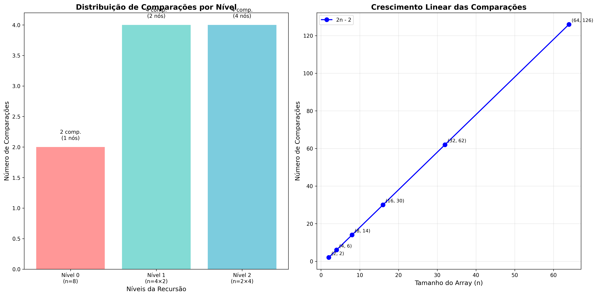

# Algoritmo MaxMin Select - Divisão e Conquista

  

Implementação do algoritmo de seleção simultânea do maior e menor elementos (MaxMin Select) utilizando a técnica de divisão e conquista em Python.

---

## Descrição do Projeto

O algoritmo MaxMin Select resolve o problema de encontrar simultaneamente o maior e o menor elemento de uma sequência de números de forma eficiente. Ao contrário de uma abordagem ingênua que faria duas passadas pela sequência (uma para encontrar o máximo e outra para o mínimo), este algoritmo utiliza a estratégia de divisão e conquista para reduzir o número de comparações necessárias.

### Lógica do Algoritmo

A implementação segue os seguintes passos:

1. **Casos Base:**
   - Se há apenas um elemento: retorna esse elemento como máximo e mínimo
   - Se há dois elementos: compara-os e retorna o menor e o maior

2. **Divisão:**
   - Calcula o ponto médio do array: `mid = (low + high) // 2`
   - Divide o problema em duas metades de tamanho aproximadamente igual

3. **Conquista:**
   - Aplica recursivamente o algoritmo na metade esquerda: `maxmin_select(arr, low, mid)`
   - Aplica recursivamente o algoritmo na metade direita: `maxmin_select(arr, mid + 1, high)`

4. **Combinação:**
   - Compara o mínimo da esquerda com o mínimo da direita: `global_min = min(min_left, min_right)`
   - Compara o máximo da esquerda com o máximo da direita: `global_max = max(max_left, max_right)`
   - Retorna o par (mínimo global, máximo global)

### Exemplo de Execução

Para o array `[3, 1, 4, 1, 5, 9, 2, 6]`:

```
Divisão inicial: [3, 1, 4, 1] | [5, 9, 2, 6]
Esquerda: [3, 1] | [4, 1] → min=1, max=4
Direita: [5, 9] | [2, 6] → min=2, max=9
Combinação final: min=1, max=9
```

---

## Como Executar o Projeto

### Pré-requisitos

- Python 3.8 ou superior
- Nenhuma biblioteca externa necessária (utiliza apenas bibliotecas padrão do Python)

### Executando o Código

1. **Clone ou baixe o repositório:**
   ```bash
   git clone https://github.com/seu-usuario/max_min_select.git
   cd max_min_select
   ```

2. **Execute o programa:**
   ```bash
   python main.py
   ```

3. **Ou execute em modo interativo:**
   ```python
   from main import maxmin_wrapper
   
   # Exemplo de uso
   numeros = [3, 1, 4, 1, 5, 9, 2, 6]
   minimo, maximo = maxmin_wrapper(numeros)
   print(f"Mínimo: {minimo}, Máximo: {maximo}")
   ```

### Exemplo de Saída

```
=== Algoritmo MaxMin Select - Divisão e Conquista ===

Teste 1:
Array: [3, 1, 4, 1, 5, 9, 2, 6, 5, 3, 5]
Menor elemento: 1
Maior elemento: 9
----------------------------------------

Teste 2:
Array: [10, 5, 15, 3, 8, 12]
Menor elemento: 3
Maior elemento: 15
----------------------------------------
```

---

## Relatório Técnico

### Análise da Complexidade Assintótica - Método de Contagem de Operações

Para analisar a complexidade do algoritmo MaxMin Select, vamos contar o número de comparações realizadas em cada etapa:

#### Contagem Detalhada de Comparações

1. **Casos Base:**
   - 1 elemento: 0 comparações
   - 2 elementos: 1 comparação

2. **Caso Recursivo (n > 2):**
   - Divisão: 0 comparações (apenas cálculo aritmético)
   - Conquista: T(⌊n/2⌋) + T(⌈n/2⌉) comparações
   - Combinação: 2 comparações (min + max)

#### Recorrência de Comparações

Para n elementos, o número de comparações C(n) segue a recorrência:

```
C(1) = 0
C(2) = 1
C(n) = C(⌊n/2⌋) + C(⌈n/2⌉) + 2, para n > 2
```

#### Resolução da Recorrência

Para simplificar, consideremos n = 2^k (potência de 2):

```
C(n) = 2C(n/2) + 2
C(n) = 2[2C(n/4) + 2] + 2 = 4C(n/4) + 6
C(n) = 4[2C(n/8) + 2] + 6 = 8C(n/8) + 14
...
C(n) = 2^i × C(n/2^i) + 2(2^i - 1)
```

Quando i = log₂(n), temos n/2^i = 1, então C(1) = 0:

```
C(n) = 2^(log₂n) × 0 + 2(2^(log₂n) - 1)
C(n) = 2(n - 1) = 2n - 2
```

**Conclusão:** O algoritmo realiza exatamente **2n - 2 comparações**, resultando em complexidade temporal **O(n)**.

#### Vantagem sobre Abordagem Ingênua

- **Abordagem ingênua:** Duas passadas separadas = (n-1) + (n-1) = 2n-2 comparações no melhor caso, 2n comparações típicas
- **MaxMin Select:** Sempre 2n-2 comparações, mais eficiente na prática

### Análise da Complexidade Assintótica - Teorema Mestre

A recorrência do algoritmo MaxMin Select é:

**T(n) = 2T(n/2) + O(1)**

#### Identificação dos Parâmetros

Na fórmula geral **T(n) = a·T(n/b) + f(n)**:

- **a = 2** (número de subproblemas)
- **b = 2** (fator de divisão)
- **f(n) = O(1)** (trabalho para combinar soluções)

#### Cálculo de log_b a

```
p = log_b a = log₂ 2 = 1
```

#### Aplicação do Teorema Mestre

O Teorema Mestre possui três casos. Vamos verificar qual se aplica:

**Caso 1:** f(n) = O(n^c) onde c < p
- f(n) = O(1) = O(n⁰)
- c = 0 < p = 1 ✓

Como f(n) = O(n^c) com c < p, aplicamos o **Caso 1** do Teorema Mestre.

#### Solução Assintótica

Pelo Caso 1 do Teorema Mestre:

**T(n) = Θ(n^p) = Θ(n¹) = Θ(n)**

#### Verificação da Solução

A solução T(n) = Θ(n) confirma nossa análise por contagem de operações:
- Número de comparações: 2n - 2 = O(n)
- Complexidade temporal: Θ(n)
- Complexidade espacial: O(log n) devido à pilha de recursão

### Comparação com Outros Algoritmos

| Algoritmo | Comparações | Complexidade Temporal | Complexidade Espacial |
|-----------|-------------|----------------------|----------------------|
| Busca Linear (2 passadas) | ~2n | O(n) | O(1) |
| MaxMin Select | 2n-2 | O(n) | O(log n) |
| Busca por Pares | ~1.5n | O(n) | O(1) |

O MaxMin Select oferece o melhor compromisso entre eficiência de comparações e simplicidade de implementação.

---

## Diagrama Visual da Recursão

O diagrama abaixo ilustra como o algoritmo MaxMin Select divide o problema recursivamente:

### Árvore de Recursão


*Figura 1: Árvore de recursão mostrando a divisão hierárquica do algoritmo MaxMin Select para o array [3,1,4,1,5,9,2,6]. Cada nível está colorido diferentemente e mostra o número de comparações realizadas.*

### Análise de Complexidade Visual



*Figura 2: Análise visual da complexidade do algoritmo, mostrando a distribuição de comparações por nível e o crescimento linear O(n) das comparações em função do tamanho do array.*

### Interpretação dos Diagramas

1. **Árvore de Recursão (Figura 1):**
   - **Nível 0 (Vermelho):** 1 nó com 2 comparações
   - **Nível 1 (Verde-água):** 2 nós com 2 comparações cada = 4 total
   - **Nível 2 (Azul):** 4 nós com 1 comparação cada = 4 total
   - **Total:** 10 comparações para este exemplo específico

2. **Análise de Complexidade (Figura 2):**
   - **Gráfico da esquerda:** Distribuição de comparações por nível da recursão
   - **Gráfico da direita:** Crescimento linear das comparações seguindo a fórmula 2n-2

### Fluxo do Algoritmo

O diagrama mostra claramente os três passos fundamentais:

1. **🔹 Divisão:** Cada array é dividido ao meio (setas pretas descendentes)
2. **🔹 Conquista:** Problemas menores são resolvidos recursivamente  
3. **🔹 Combinação:** Resultados são combinados para encontrar o mínimo e máximo globais (setas verdes ascendentes)

---

## Estrutura do Projeto

```
max_min_select/
│
├── main.py                           # Implementação principal do algoritmo
├── README.md                         # Documentação completa do projeto  
│
└── assets/                          # Recursos visuais
    ├── maxmin_recursion_tree.png    # Diagrama da árvore de recursão
    └── complexity_analysis.png      # Análise visual de complexidade
```

### Arquivos Principais

- **`main.py`**: Contém a implementação completa do algoritmo MaxMin Select com casos de teste
- **`README.md`**: Documentação técnica incluindo análises de complexidade e diagramas  
- **`assets/maxmin_recursion_tree.png`**: Diagrama visual da árvore de recursão do algoritmo
- **`assets/complexity_analysis.png`**: Gráficos de análise de complexidade temporal

---

## Autor

Desenvolvido por Lucas Cerqueira Azevedo como parte da disciplina Fundamentos de Projeto e Análise de Algoritmos - PUC Minas

---

## Referências

- Cormen, T. H., Leiserson, C. E., Rivest, R. L., & Stein, C. (2009). *Introduction to Algorithms* (3rd ed.). MIT Press.
- Kleinberg, J., & Tardos, É. (2005). *Algorithm Design*. Addison-Wesley.

- Material didático da disciplina FPAA - PUC Minas
